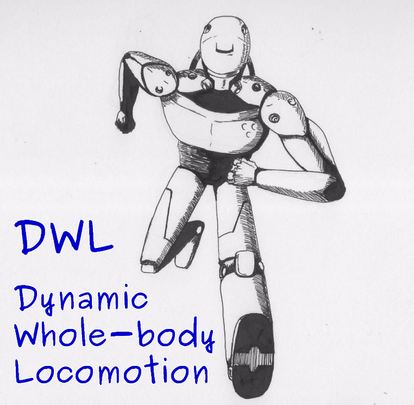

# dwl_ros - Dynamic Whole-body Locomotion Library Forked from IIT



## Dependencies

dwl_ros has the following required dependencies:
* [Boost](http://www.boost.org) (version 1.5.4 or higher)
* [CMake](http://www.cmake.org) (version 2.8.3 or higher)
* [Eigen](http://eigen.tuxfamily.org) (version 3.2.0 or higher)
* [Yaml-cpp](https://code.google.com/p/yaml-cpp/) (version 0.5.2 or higher)
* [RBDL](http://rbdl.bitbucket.org/) (version 2.4.0 or higher)
* [urdfdom_header](https://github.com/ros/urdfdom_headers) (version 0.2.3 or higher)
* [console_bridge](https://github.com/ros/console_bridge) (version 0.2.7 or higher)
* [urdfdom](https://github.com/ros/urdfdom) (version 0.2.10 or higher)
* [Octomap](http://octomap.github.io) (version 1.6.8 or higher)

you can install all the dependencies with script file.

The following dependencies are optional, mainly used by optimization:
* [Doxygen](http://www.doxygen.org)
* [qpOASES](https://projects.coin-or.org/qpOASES) (version 3.2.0 or higher)
* [Ipopt](https://projects.coin-or.org/Ipopt) (version 3.12.4 or higher)
* [libcmaes](https://github.com/beniz/libcmaes) (version 0.9.5 or higher)


## Build

Install package as catkin project as follows, more easy, more friendly:
```
cd your catkin workspace
catkin_make
```

## Contribution

**I tried to install initial DWL package as catkin project, but it seemed to appear some error, so created a new purely catkin package, more friendly to users.**
